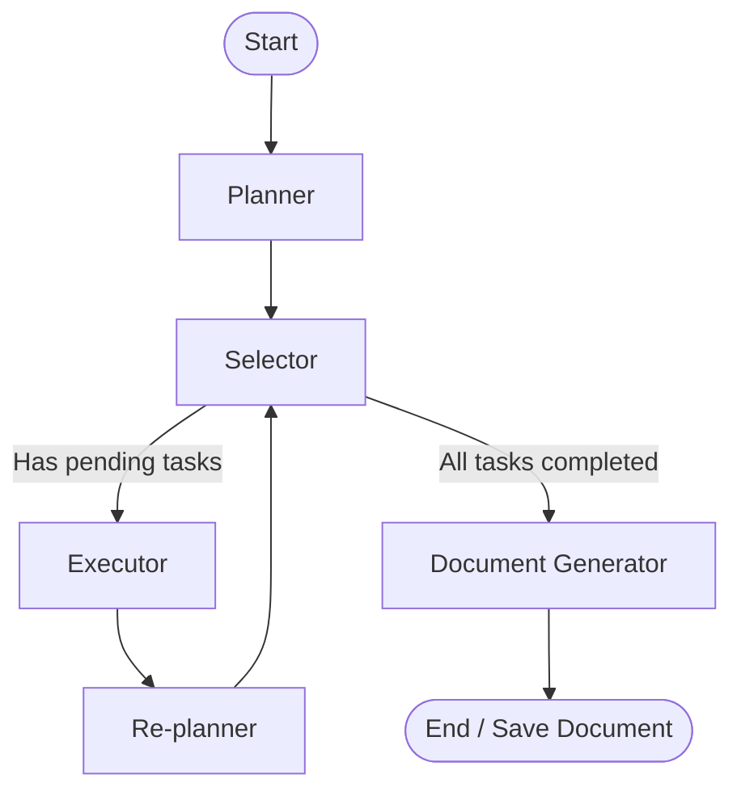

# Autonomous Document Agentic System (Fluid AI)

An intelligent, self-correcting agentic workflow built with **LangGraph**, **LangChain**, and **FastAPI** that autonomously researches, structures, drafts, and compiles high-quality, professionally formatted Microsoft Word (`.docx`) documents from brief user prompts.

---

## 🚀 Key Features

* **Dynamic Planning & Re-planning Loop**: The agent generates an initial task-based outline. After executing each task (e.g., a section draft or research action), a re-planner node evaluates the output and dynamically updates the plan—adding, modifying, or completing tasks.
* **Tool-Equipped Execution**: Utilizes **Tavily Search** to crawl the web for relevant context and industry standards, and leverages LLMs to synthesize research.
* **Resilient LLM Routing & Fallback**:
  * Employs **Llama 3.3 (70B)** as the primary model.
  * Gracefully falls back to **Llama 3.1 (8B)** if primary rate limits (HTTP 429) are encountered.
  * Implements raw JSON schema parsing and verification if structured tool binding fails.
* **Minimalist Academic Word Builder**: Converts raw markdown content (including tables, bullets, numbering, bold, italics, and inline code) into a professional Word document styled in accordance with clean APA/Academic guidelines (Times New Roman, 1-inch margins, 1.15 line spacing, and horizontal-only borders for tables).
* **Interactive Web Interface**: A modern web application built on **FastAPI** that showcases the real-time execution logs, dynamic planner steps, and direct file download links.

---

## 📐 System Architecture

The core agent is powered by a state machine compiled using **LangGraph**. The workflow cycles through planning, selection, execution, and dynamic re-evaluation before compiling the final document:



### Graph Nodes Explained
1. **Planner (`planner_node`)**: Receives the initial request, sets a formal document title, and creates an initial sequence of 2-5 tasks.
2. **Selector (`selector_node`)**: Decides the next pending task to run. Has a guardrail to limit execution to 8 steps maximum to prevent infinite planning loops.
3. **Executor (`executor_node`)**: Runs the assigned tool (`web_search`, `draft_section`, or a generic LLM task) to draft content or fetch information.
4. **Replanner (`replanner_node`)**: Evaluates results, updates the state's document section registry, marks the current task as complete, and determines if new sections/research steps are required.
5. **Generator (`generator_node`)**: Gathers completed drafts in their logical order and builds the final styled `.docx` file using the `doc_builder` engine.

---

## 📂 Project Structure

```text
├── agent.py               # Core LangGraph definition, nodes, and agent loop execution
├── doc_builder.py         # Word document creation engine with custom markdown-to-docx parser
├── main.py                # FastAPI server rendering the web page and running the agent API
├── test_agent.py          # Integration test runner for the agent pipeline
├── verify_requests.py     # HTTP integration test suite verifying standard and complex API payloads
├── requirements.txt       # Core project dependencies
├── pyproject.toml         # Project metadata and package dependencies
├── templates/
│   └── index.html         # Interactive web interface frontend template
├── static/
│   └── style.css          # Frontend layout and design stylesheets
└── generated_docs/        # Output folder where generated Word documents are stored
```

---

## 🛠️ Setup & Installation

Before running the application, copy the template file `.env.example` to `.env` in the root directory and configure your API keys for [Groq](https://groq.com/) and [Tavily](https://www.tavily.com/):

**Linux / macOS:**
```bash
cp .env.example .env
```

**Windows (Command Prompt):**
```cmd
copy .env.example .env
```

**Windows (PowerShell):**
```powershell
Copy-Item .env.example .env
```
And update the values in `.env`:
```env
GROQ_API_KEY="your-groq-api-key"
TAVILY_API_KEY="your-tavily-api-key"
```

Choose one of the installation methods below to get the application up and running:

### Option A: Manual Local Setup

#### 1. Prerequisites
Ensure you have Python **3.13** or higher installed.

#### 2. Install Dependencies
Using standard `pip`:
```bash
pip install -r requirements.txt
```
Or using `uv` (recommended):
```bash
uv sync
```

#### 3. Run the Application
Launch the server using `uvicorn`:
```bash
uvicorn main:app --reload
```
Once running, open your browser and navigate to:
👉 **[http://127.0.0.1:8000](http://127.0.0.1:8000)**

---

### Option B: Containerized Setup (Using Docker)

#### 1. Prerequisites
Ensure you have [Docker](https://docs.docker.com/get-docker/) and [Docker Compose](https://docs.docker.com/compose/install/) installed.

#### 2. Run the Application
Build and start the container using Docker Compose:
```bash
docker compose up --build
```
Once started, the application will be accessible at:
👉 **[http://127.0.0.1:8000](http://127.0.0.1:8000)**

> [!TIP]
> The `docker-compose.yml` mounts the `./generated_docs` directory on your host machine. Any Word documents generated by the agent inside the container will automatically appear in your local workspace.

---

## 🧪 Testing and Verification

To ensure all agents and components are integrated and working properly:

### 1. Local Integration Test
Runs a basic CLI-based check that triggers the planning, drafting, and compilation cycle:
```bash
python test_agent.py
```

### 2. API Test Suite
With the server running (`uvicorn main:app --reload`), run the request verification suite in a separate terminal. This runs standard and complex, ambiguous requests to verify output compliance and server downloads:
```bash
python verify_requests.py
```